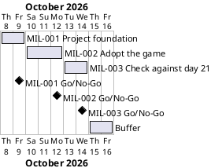

# Project Plan: Snake Game (Day 21)

## Metadata
| Key | Value |
| --- | --- |
| ID | PP-001 |
| CrossReference | [BC-001], [SA-001], [MIL-001], [MIL-002], [MIL-003] |
| Language | en |
| Domain | it |

## Version History
| Date | Status | Author | Reviewer | Change | Commit |
| --- | --- | --- | --- | --- | --- |
| 2026-10-08 | Deprecated | Jens Tirsvad Nielsen | S01 | Sync applied: milestone links and issue numbers; description and topics set; open issues closed on S01's instruction in chat | [f13d004] |
| 2026-10-08 | Accepted | Jens Tirsvad Nielsen | S01 | Closed the GitHub copy open issue: the copy already shows the description and topics, which this project did not set; closed on S01's instruction in chat | [012b839] |

---

## Purpose

This plan schedules the three milestones that deliver the Snake Game (Day 21) repository of [BC-001] in one phase of about one week. The repository starts from the finished `main` of the day-20 repository [020-snake-game] (commit `1a638c9`), which already holds the game of days 20 and 21 with tests and documentation. The three milestones therefore adopt that base, check it against the day-21 lectures, and finish the repository. Each milestone is one gateway document, one branch and one pull request, so that every step is kept track of and reviewed before the next one starts.

## Planning Assumptions

- The phase starts 2026-10-08 and ends by 2026-10-16, which leaves two days of buffer after [MIL-003]. All dates are proposed and need the Product Owner's confirmation (see Open Issues).
- Phase length: one to three days per milestone, sized for the spare time of S01, who owns every phase ([SA-001]).
- The starting point is the finished base, not the day-20 state. S01 chose this on 2026-10-08, in chat, after being told that the base already holds the day-21 features. The plan therefore does not rebuild the game in lecture order; it splits the work by activity: the foundation files ([MIL-001]), the game and its tests ([MIL-002]), and the check against the lectures ([MIL-003]).
- The base is copied file by file, so each adopted file is a task, and every difference from the base is listed in the pull request.
- One branch per milestone, named after it (`mil-001-project-foundation`, `mil-002-adopt-the-game`, `mil-003-check-against-day-21`), and one pull request that closes the issues of that milestone with one `Closes #N` line each.
- Nothing is committed, pushed or merged until S01 asks; S01 reviews the working tree first.
- The plan gate is enabled for commits in this clone (`core.hooksPath` is `framework/githooks`): a commit that changes `src/` or `tests/` needs a `Task: MIL-NNN#N` trailer for an accepted, reviewed milestone.

## Gateway Schedule

| Gateway | Document | Window | Decision date | Owner | Stories | Main deliverable | Milestone |
| --- | --- | --- | --- | --- | --- | --- | --- |
| Project foundation | [MIL-001] | 2026-10-08 to 2026-10-09 | 2026-10-09 | S01 | None (see Open Issues) | `pyproject.toml`, `.gitignore`, `constants.py`, README, `Doxyfile`, continuous integration (CI) workflow, repository description and topics | [milestone-88] |
| Adopt the game | [MIL-002] | 2026-10-10 to 2026-10-12 | 2026-10-12 | S01 | None (see Open Issues) | `Snake`, `Food`, `Scoreboard`, the main flow and `python -m snake_game`, with their tests and the README for the adopted game | [milestone-89] |
| Check against day 21 | [MIL-003] | 2026-10-13 to 2026-10-14 | 2026-10-14 | S01 | None (see Open Issues) | Comparison with the five day-21 lectures, corrections, finished README | [milestone-90] |



## Scope Coverage

| Business Case scope item | Gateway |
| --- | --- |
| Adopting the finished game of the base: configuration, constants, workflow | [MIL-001] |
| Adopting the finished game of the base: `Snake`, `Food`, `Scoreboard`, the main flow and the tests | [MIL-002] |
| Day-21 lecture "Inheritance and slicing": `Food` and `Scoreboard` inherit from `Turtle`, the tail is a slice | [MIL-002] (adopted), [MIL-003] (checked) |
| Day-21 lecture "Detect collisions with food": the `Food` class, `refresh`, the eating distance | [MIL-002] (adopted), [MIL-003] (checked) |
| Day-21 lecture "Scoreboard": the `Scoreboard` class, `increase_score`, `update_scoreboard` | [MIL-002] (adopted), [MIL-003] (checked) |
| Day-21 lecture "Wall": the wall at 280 and the game-over text | [MIL-002] (adopted), [MIL-003] (checked) |
| Day-21 lecture "Tail": `extend`, `add_segment` and the tail check | [MIL-002] (adopted), [MIL-003] (checked) |
| Checking each rule against the lecture summaries and correcting the base | [MIL-003] |
| Constants in `constants.py`; `src/`, `tests/`, `docs/` layout | [MIL-001], corrected in [MIL-003] where a value differs |
| `pyproject.toml`, Python `.gitignore`, `Doxyfile`, README, continuous integration workflow | [MIL-001], README updated in [MIL-002] and finished in [MIL-003] |
| Repository description and topics | [MIL-001] (task 7), checked again in [MIL-003] |

## Dependencies

```
MIL-001 → MIL-002 → MIL-003
```

A No-Go on a gateway returns it to S01 for rework and moves every later date by the same number of days; the two buffer days absorb up to two days of slip before the end date 2026-10-16 moves.

## Plan Risks

| Risk | Impact | Mitigation |
| --- | --- | --- |
| The planning documents take longer to review than the work left on the game | The first gateway slips | Review [BC-001], [SA-001], [DICT-001] and this plan together in one sitting; keep the milestones small |
| Author and reviewer are the same person (S01) | A review can miss a defect | Use the Quality Criteria (QC) checklists and the pull request as the second look; recorded in [BC-001] |
| The git host has no Actions runner | The CI workflow is never executed | Run the same commands locally before each pull request; decide later whether a runner is needed |
| Lecture details are only available as the summaries in the request | The game differs from the video | S01 compares the finished game with the video at the [MIL-003] Go/No-Go |
| The base was written against assumed day-21 numbers | [MIL-003] finds differences late | The numbers are listed in the lecture-point table of [MIL-003]; a difference is corrected there with a test |
| The base and this repository hold the same code | A later fix reaches only one of them | Out of scope by decision (see [BC-001]); each pull request lists the differences from the base |
| The sync matches issues by title, so a title used twice overwrites an issue | A task disappears from the board | Every task title is unique across all milestones; check before each `--apply` |

## Open Issues

- **Dates:** the start date, milestone lengths and the end date 2026-10-16 are proposed and not given by the Product Owner; confirm or replace them.
- **Product Owner (PO) language:** the request is written in English, so `en` is recorded in `docs/artifact-registry.md`; the sections of every PO-language document follow it. Confirm, because a later change needs a new review of each document.
- **Stakeholder levels:** the Power and Interest levels of S02 and S03 in [SA-001] are proposals, taken over from the day-20 repository.
- **Starting point (closed by S01 on 2026-10-08):** S01 chose the finished `main` of [020-snake-game] as the base, not the day-20 state and not a rebuild.
- **Repository address:** the request names `https://git.tirsystem.com/Tirsvad-Udemy-100_days_of_code` (underscores), but `origin` of this clone is `https://git.tirsystem.com/Tirsvad-Udemy-100-days-of-code/021-snake-game` (hyphens). The plan uses the address of `origin`, where the repository exists. Confirm.
- **Repository description and topics (closed by S01 on 2026-10-08):** S01 confirmed the text proposed in the Deliverable of [MIL-001] (a description and twelve topics, the same topics as the day-20 repository). It was set on the Gitea repository on 2026-10-08 with the Gitea API; criterion 9 of [MIL-001] checks it.
- **GitHub copy (closed by S01 on 2026-10-08):** a GitHub copy of this repository exists next to the Gitea one. When it was checked on 2026-10-08 it showed the same description and topics as the Gitea repository. This project did not set them: S01 confirmed the text for the Gitea repository only. In the day-20 repository a workflow on the git host sets them, so this project does not touch the GitHub copy, and no task is added.
- **"Python greater than 3.13":** read as Python 3.13 or newer (`requires-python = ">=3.13"`); the machine of S01 has Python 3.13.14, which a strict "greater than 3.13" would exclude. Confirm.
- **README template:** the Product Owner's README template is used. It differs from `framework/templates/README-template.md`, whose section titles `framework/scripts/check-readme.sh` expects; that check is opt-in and stays off.
- **Inheritance and display-free tests:** the day-21 lectures teach `class Food(Turtle)`, but a class that inherits from `Turtle` needs `turtle` (and so `tkinter`) at import time, unlike `Snake`. The base keeps the inheritance and has the tests install a fake `turtle` module before they import the classes, and `main` imports `food` and `scoreboard` only when it runs. Confirm, or ask for composition instead.
- **Food under the snake:** the lecture's `refresh` picks a random place without looking at the snake, and so does the base. Confirm, or ask for a place that is free.
- **High score:** no lecture of day 21 stores a high score; it is out of scope. Confirm.
- **No user story or use case:** the tasks are written as build and check steps, so they are plain technical tasks. If the player's goal (steer the snake) should be modelled, add a Use Case Diagram, a user story and a use case and reference them from the task rows.
- **Governance and traceability matrix:** `GOV` and `TM` do not exist yet. The review process asks for both (sign-off route and the "Last Reviewed" column). Decide whether to create them before the first review record is written.
- **Diagram check:** the Gantt chart above was not rendered because no PlantUML server is configured (`PLANTUML_URL`); render it before the review.
- **Sync:** done on 2026-10-08 with `sync-project.sh --accepted-only --apply`: Milestones 88 to 90 and Issues #1 to #22 exist on the git host (MIL-001: #1 to #7, MIL-002: #8 to #14, MIL-003: #15 to #22). The sync matches issues by title, so every task title must be unique across all milestones; they are. Run the sync again whenever a `## Tasks` table changes. It used `GITEA_TOKEN` from the personal `.env` file, which the project never imports.

---

[BC-001]: ./business-case.md
[SA-001]: ./stakeholder-analysis.md
[DICT-001]: ./dictionary.md
[MIL-001]: ./milestones/mil-001-project-foundation.md
[MIL-002]: ./milestones/mil-002-adopt-the-game.md
[MIL-003]: ./milestones/mil-003-check-against-day-21.md
[020-snake-game]: https://git.tirsystem.com/Tirsvad-Udemy-100-days-of-code/020-snake-game
[milestone-88]: https://git.tirsystem.com/Tirsvad-Udemy-100-days-of-code/021-snake-game/milestone/88
[milestone-89]: https://git.tirsystem.com/Tirsvad-Udemy-100-days-of-code/021-snake-game/milestone/89
[milestone-90]: https://git.tirsystem.com/Tirsvad-Udemy-100-days-of-code/021-snake-game/milestone/90
[f13d004]: https://git.tirsystem.com/Tirsvad-Udemy-100-days-of-code/021-snake-game/commit/f13d004447ceb631cb22c058d68a21b721a3f04c
[012b839]: https://git.tirsystem.com/Tirsvad-Udemy-100-days-of-code/021-snake-game/commit/012b83987c3c48191fc91815639a39d7ccf91a0b
